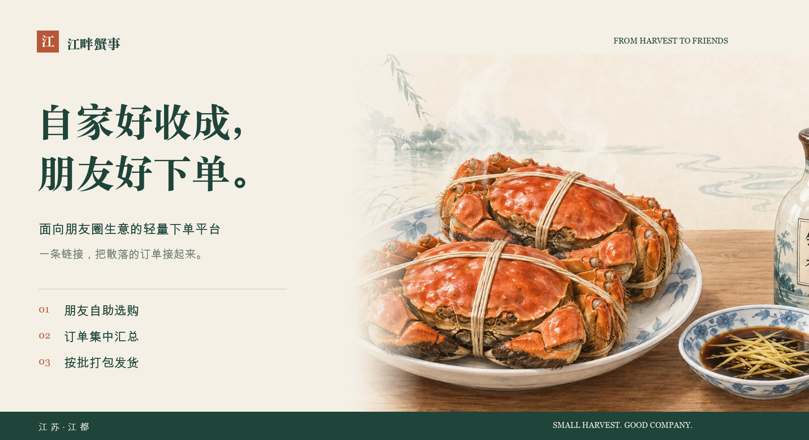
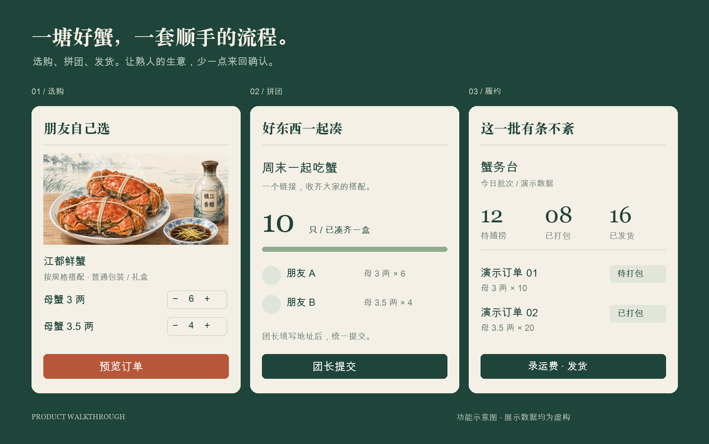
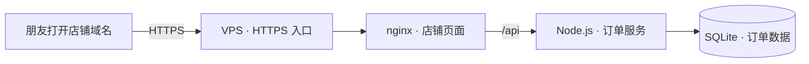

<p align="center">
  
</p>

<div align="center">

# 江畔蟹事

**自家好收成，朋友好下单。**

面向朋友圈生意的轻量下单平台 · 从一塘大闸蟹开始

[](package.json)
[](server/package.json)
[](server/src/db.js)
[](docs/baseline.md)

[为什么做](#从一句给我留两盒开始) · [能做什么](#朋友下单你来安排好这一批) · [如何部署](#一台-vps一个域名就是自己的小店) · [本地体验](#本地跑起来) · [开发文档](docs/README.md)

</div>

---

## 从一句“给我留两盒”开始

自家养的蟹，朋友吃过觉得好。发条朋友圈，就有人来问。

生意不复杂，消息却很碎：要哪种规格、送几个地址、谁还差几只、今天该装几箱。到了最忙的时候，一边备货，一边翻聊天记录。

**江畔蟹事，想把这件事变简单。**

分享一个链接，朋友自己选规格、填地址、看订单；你按批次看汇总，照着清单打包发货。熟人之间的信任照旧，重复的记录交给系统。

## 朋友下单，你来安排好这一批

| 对朋友 | 对自家生意 |
| :--- | :--- |
| **轻轻进来** · 下单码进入，不必走繁琐注册流程 | **看清这一批** · 按公母、规格汇总待捕捞数量 |
| **自己搭配** · 自选规格、预设套装、普通包装或礼盒 | **少翻聊天记录** · 收货信息、份数、明细集中管理 |
| **一次送多家** · 粘贴识别地址，多地址拆单 | **顺手发货** · 捕捞 → 打包 → 录入运费 → 发货 |
| **朋友一起凑** · 分享拼团链接，由团长统一提交 | **规则有兜底** · 截单、停售、缺货由服务端校验 |
| **下次照着买** · 保存套装、查看历史、同配置再下单 | **账目有依据** · 价格快照、分摊运费、幂等防重单 |



<sub>根据现有功能重新排版的界面示意，非原始页面截图；展示数据均为虚构。</sub>

## 轻一些，刚刚好

**下单在线，结算线下。** 不接在线支付，不要求朋友另装 App；订单和履约留在网页里，付款由双方自行安排。

**小生意，也认真记账。** 数据落在 SQLite，金额由服务端计算，历史订单保留价格快照；下单码换成 HttpOnly 会话，后台按角色授权。

**有自己的样子。** 水彩蟹图、江南色调、清楚的规格表，再配上可分享的店铺与拼团海报。手机上好用，也拿得出手。

## 从一塘蟹，到更多好收成

这套流程也适合自家鸡蛋、鸡鸭、鲜鱼等农产品的熟人直售：**分享 → 自助下单 → 集中备货 → 按单交付**。

| 场景 | 可以沿用的流程 | 需要改造的部分 |
| :--- | :--- | :--- |
| **一塘鲜蟹 · 当前已落地** | 自选规格、朋友拼单、批次汇总、打包发货 | 当前版本可运行 |
| **一篮鲜蛋 · 改造方向** | 按份预订、多地址送礼、集中备货 | 枚 / 盒单位、盒装数量、破损与配送规则 |
| **自养鸡鸭、塘里鲜鱼 · 改造方向** | 预约下单、按批整理、逐单交付 | 只 / 斤单位、活鲜或处理规格、按重计价与重量差额 |

**可以复用的是接单与交付的思路，品类规则仍需认真适配。** 鸡蛋与禽鱼场景属于延展设想，不代表仓库已经内置相应商品模块。

不过，当前代码仍保留大闸蟹的公母规格、每盒 10 只、季节开售与捕捞流程。迁移到其他品类时，需要调整规格、计价单位、包装容量和履约文案；它是一份真实生意打磨出来的起点。

<details>
<summary><strong>技术与边界</strong></summary>

- 前端：React + Vite，用户端、拼团页与「蟹务台」管理端。
- 后端：Fastify + SQLite，显式迁移、事务、价格快照与订单归属校验。
- 分享：浏览器生成海报与二维码，链接随部署域名生成。
- 登录：下单码属于访问凭据；采用轻量身份机制，无短信认证、微信 OAuth 或实名验证。
- 当前没有在线支付、支付对账、自动物流跟踪、多商户或通用品类管理。
- 生产部署需要自行配置 HTTPS、强管理员凭据、备份与监控。

</details>

## 一台 VPS，一个域名，就是自己的小店

**推荐自托管：一台 Linux VPS + 一个域名 + HTTPS。** 前端、后端和 SQLite 数据库放在同一台服务器，朋友通过你的域名打开网页即可下单，无需单独购买数据库服务。



- **准备服务器**：有 SSH 管理权限的 Linux VPS，安装 Node.js 22 LTS、nginx 和 SQLite 工具。
- **绑定域名**：将域名解析到 VPS，配置 HTTPS 证书与自动续期；店铺与拼团海报会使用当前访问域名生成链接。
- **保存好数据**：订单库独立于应用代码存放，定时备份，并另存一份到服务器之外。
- **日常维护**：配置管理员凭据，关注服务存活、磁盘空间和备份结果。主要持续成本是 VPS 与域名。

完整步骤见 [VPS 部署手册](deploy/README.md)。这是一套自己掌握代码和数据的小店，需要部署者负责服务器运维。

## 本地跑起来

建议使用 **Node.js 22.12+（22 LTS）**。同一机器安装依赖与运行服务时保持 Node 版本一致，避免 SQLite 原生模块 ABI 不匹配。

```bash
git clone https://github.com/seldoms/jiangpan-xieshi.git
cd jiangpan-xieshi
npm ci
npm --prefix server ci
npm --prefix server run seed   # 仅首次初始化本地演示库
```

分别打开两个终端：

```bash
npm run dev                   # 前端 http://localhost:5173
```

```bash
npm --prefix server run dev   # 后端 http://localhost:3001
```

演示用户下单码为 `测试用户a1b2`。需要后台时，在本地显式创建自己的超级管理员：

```bash
npm --prefix server run provision:superadmin -- 你自己设置的下单码
```

`seed` 包含演示价格与开发账号，仅用于本地体验；生产环境使用独立数据库和凭据。2026 年 10 月 1 日中国零点前，公蟹按当前季节规则暂停销售，可用母蟹体验下单。

<details>
<summary><strong>验证与部署</strong></summary>

```bash
npm run build
npm --prefix server test
node --test scripts/purchase-availability.test.mjs
node scripts/address-parser-selftest.mjs
```

发布基线验证：前端构建通过、后端 189 项测试通过、前端可售规则 5 项通过。记录见 [基线说明](docs/baseline.md)。

部署步骤见 [部署手册](deploy/README.md)，业务规则见 [决策记录](docs/decisions.md)，后续开发先读 [AGENTS.md](AGENTS.md)。

</details>

---

<div align="center">

**把好东西送到朋友手里。剩下的，简单一点。**

<sub>江畔蟹事 · Built for a small harvest, shared with friends.</sub>

</div>
